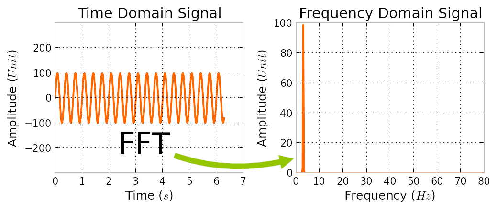
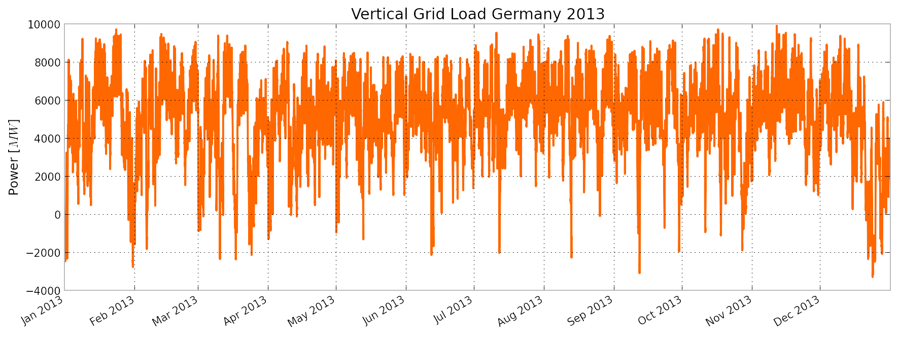
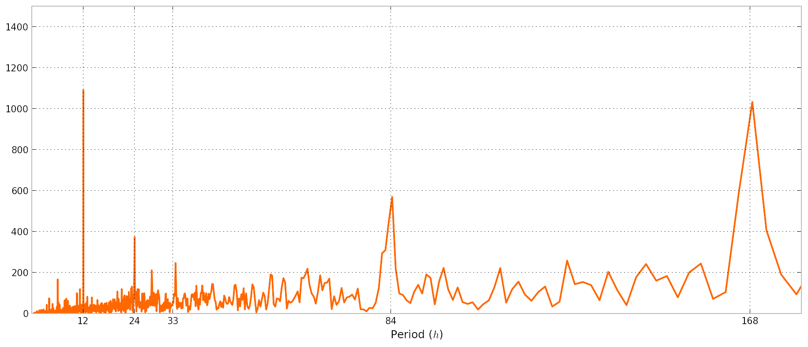

Fourier Transform
==========

## FFT Examples in Python

This tutorial covers step by step, how to perform a Fast Fourier Transform with Python.

Including

* How to scale the x- and y-axis in the amplitude spectrum
* Leakage Effect
* Windowing

### [Take a look at the IPython Notebook](./FFT-Tutorial.ipynb)

Fourier analysis is a method for expressing a function as a sum of periodic components, and for recovering the signal from those components. When both the function and its Fourier transform are replaced with discretized counterparts, it is called the discrete Fourier transform (DFT).

- [Some examples](./FFT-Tutorial.py)

### Real World Data Example

From

To

## Reference

- [FFT-Python](https://github.com/balzer82/FFT-Python)
